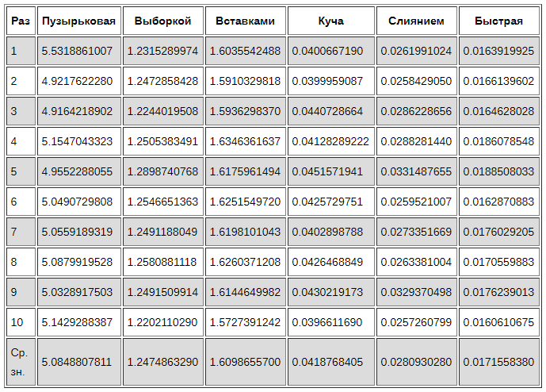

Сравнение скоростей сортировок

Для сравнения сгенерируем массив из 5000 чисел от 0 до 1000. Затем определим время, необходимое для завершения каждого алгоритма. Повторим каждый метод 10 раз, чтобы можно было более точно установить, насколько каждый из них производителен.

Пузырьковая сортировка — самый медленный из всех алгоритмов. Возможно, он будет полезен как введение в тему алгоритмов сортировки, но не подходит для практического использования.
Быстрая сортировка хорошо оправдывает своё название, почти в два раза быстрее, чем сортировка слиянием, и не требуется дополнительное место для результирующего массива.
Сортировка вставками выполняет меньше сравнений, чем сортировка выборкой и в реальности должна быть производительнее, но в данном эксперименте она выполняется немного медленней. Сортировка вставками делает гораздо больше обменов элементами. Если эти обмены занимают намного больше времени, чем сравнение самих элементов, то такой результат вполне закономерен.

Встроенные функции сортировки на Python

Иногда полезно знать перечисленные выше алгоритмы, но в большинстве случаев разработчик, скорее всего, будет использовать функции сортировки, уже предоставленные в языке программирования.

Отсортировать содержимое списка можно с помощью стандартного метода sort():

> apples_eaten_a_day = [2, 1, 1, 3, 1, 2, 2]
> 
> apples_eaten_a_day.sort()
> 
> apples_eaten_a_day
> 
[1, 1, 1, 2, 2, 2, 3]

Или можно использовать функцию sorted() для создания нового отсортированного списка, оставив входной список нетронутым:

>apples_eaten_a_day_2 = [2, 1, 1, 3, 1, 2, 2]
> 
>sorted_apples = sorted(apples_eaten_a_day_2)
> 
>sorted_apples
> 
[1, 1, 1, 2, 2, 2, 3]

Оба эти метода сортируют в порядке возрастания, но можно изменить порядок, установив для флага reverse значение True:

### Обратная сортировка списка на месте
> apples_eaten_a_day.sort(reverse=True)
> 
> apples_eaten_a_day
> 
[3, 2, 2, 2, 1, 1, 1]

### Обратная сортировка, чтобы получить новый список
> sorted_apples_desc = sorted(apples_eaten_a_day_2, reverse=True)
> 
> sorted_apples_desc
> 
[3, 2, 2, 2, 1, 1, 1]

В отличие от других алгоритмов, обе функции в Python могут сортировать также списки кортежей и классов. Функция sorted() может сортировать любую последовательность, которая включает списки, строки, кортежи, словари, наборы и пользовательские итераторы, которые вы можете создать.

Функции в Python реализуют алгоритм Tim Sort, основанный на сортировке слиянием и сортировке вставкой.